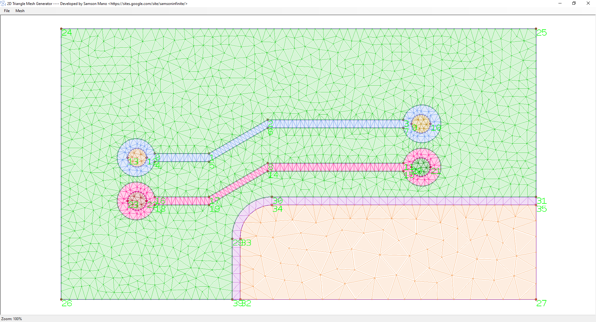

# 2DTriangle_Mesh_Generator

The 2D Triangle Mesh Generator is a program designed to create 2D meshes for any number of surfaces, including multiple nested surfaces, and can handle a large number of elements. This program utilizes model openGL to render the mesh, making it capable of handling millions of elements without issues. 

To learn how to use this software, please refer to the How_to_use.pdf guide included in the program. 

The meshes generated by this program can be exported as a raw text file. The main objective of this program is to mesh any 2D surface domain, which can be used to solve 2D problems using finite element, finite difference, or other PDE solvers.

The main constrained Delaunay triangulation code for this program can be found at the link below:
https://github.com/Samson-Mano/2DTriangle_Mesh_Generator/tree/master/2DTriangle_Mesh_Generator/mesh_control/delaunay_triangulation

To test out the program, several examples of mesh surfaces are included in the Examples folder:
https://github.com/Samson-Mano/2DTriangle_Mesh_Generator/tree/master/Examples

Below are some examples of the meshes generated using this program. This software is free to use and if you come across any bugs, please feel free to inform me.

